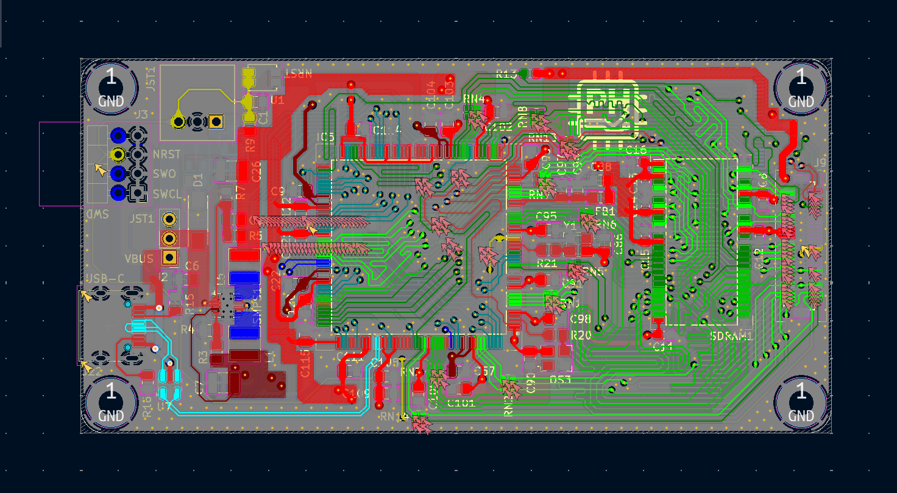

# STM32H7S3 High-Performance Modular Compute Platform

  
   
  <em>4-layer PCB diagram.</em>

## 📑 Quick Access
* [**📂 View Project Schematics (PDF)**](./Schematics/STM32H7_Board_Schematics.pdf)

## 📌 Project Overview
This project features a professional-grade, high-speed embedded system centered around the **STM32H7S3I8T6** (ARM Cortex-M7 running at 600 MHz). Developed as a post-graduate technical showcase, this board demonstrates proficiency in high-speed digital design, complex memory interfacing (SDRAM/NAND), and modular system architecture.

The platform is designed to serve as a high-bandwidth "Main Compute Module" that interfaces with expansion boards via a variety of industrial-standard protocols (PSSI, I2S, I2C, SPI, UART).

## 🛠 Technical Specifications

### Core Processing & Memory
* **MCU:** STM32H7S3I8T6 (600 MHz, 1MB SRAM, advanced security and graphics acceleration).
* **SDRAM:** 256 Mbit (IS42S83200J) @ 166 MHz — utilized for high-speed frame buffering and large-scale data processing.
* **NAND Flash:** 2 Gbit (MT29F2G08) — providing robust, non-volatile storage for OS and data logging.

### Connectivity & Expansion
* **PSSI (Parallel Synchronous Slave Interface):** Dedicated high-speed parallel bus for camera or FPGA data acquisition.
* **Audio (I2S):** High-fidelity audio interface with dedicated Master Clock (MCK) routing.
* **USB-C OTG:** High-speed (480 Mbps) data support with integrated UCPD (USB-C Power Delivery) logic.
* **Peripheral Bus:** Fully broken-out I2C, SPI, and UART headers for modular hardware stacking.

## 🚀 Engineering Design Highlights

### 1. High-Speed Signal Integrity (SI)
* **4-Layer Stackup:** Designed with a dedicated Ground plane (L2) and Power plane (L3) to provide a stable reference and minimize return path inductance.
* **Impedance Control:** Managed 90Ω differential pairs for USB High-Speed and 50Ω single-ended traces for memory clocks.
* **Memory Routing:** Implemented length-matching and fly-by/star topology considerations for the SDRAM address and data bus to meet strict setup and hold time requirements at 166 MHz.

### 2. Power Delivery Network (PDN)
* **Core Stability:** Designed for the 600 MHz switching transients of the Cortex-M7 using low-ESR ceramic decoupling arrays.
* **Via Stitching:** Utilized parallel via strategies (e.g., dual 0.3mm vias) for high-current power paths to minimize IR drop and parasitic inductance.

### 3. Hardware Robustness
* **ESD Protection:** Integrated low-capacitance TVS diode arrays on USB-C lines to protect sensitive MCU transceivers.
* **Signal Conditioning:** Series termination resistors on high-speed clocks (MCK, CK) and proper pull-up configurations for Open-Drain lines (NAND_RB).

## 🔬 Testing & Validation Plan

To ensure the reliability of a 600 MHz system, the following hardware validation protocols were implemented:

### 1. Signal Integrity (SI) Verification
Using a high-bandwidth digital oscilloscope (2 GHz+), the following critical signals are probed to verify timing margins and signal quality:
* **SDRAM Clock (166 MHz):** Measured for overshoot, undershoot, and rise/fall times ($t_R/t_F$) to ensure compliance with the IS42S83200J datasheet. 
* **Eye Diagram Analysis:** Performed on the USB High-Speed (480 Mbps) differential pairs to validate the $90\Omega$ impedance matching and ensure zero bit errors.
* **Clock Jitter:** Measured the stability of the I2S Master Clock (MCK) to prevent phase noise in audio reconstruction.

### 2. Power Integrity (PI) & Thermal Analysis
* **DC Load Testing:** Verified the 3.3V and 1.1V rails under maximum CPU/SDRAM load to ensure the IR drop across the power plane remains within $\pm 3\%$.
* **Transient Response:** Observed the $V_{CORE}$ rail during high-frequency switching to validate the effectiveness of the decoupling capacitor network.
* **Thermal Imaging:** Monitored the STM32H7S3 and SDRAM during continuous burst transfers to identify potential hotspots on the 4-layer stackup.

### 3. Memory Interface Stress Testing
* **MemTest86-style Routines:** Implemented custom firmware to perform pseudo-random pattern writes/reads across the entire 256 Mbit SDRAM space to check for bit-flip errors caused by crosstalk or timing skew.
* **NAND Bad Block Management:** Validated the ECC (Error Correction Code) and wear-leveling logic within the MT29F2G08 driver.

## 🛠 Skills Demonstrated
* **Hardware:** High-speed PCB design (Altium/KiCad), Differential Pair Routing, PDN Optimization, ESD/EMI protection.
* **Firmware:** C/C++, STM32 CubeHAL, Memory Management Units (MMU), DMA configuration.
* **Tools:** Digital Oscilloscopes, Logic Analyzers, Spectrum Analyzers.

## 📂 Repository Structure
* `/Hardware`: Schematic (PDF/Source), PCB Layout, and Layer Stackup definitions.
* `/Firmware`: BSP (Board Support Package), memory initialization code, and driver implementations.
* `/Docs`: Power budget analysis and timing margin calculations.

## 🎓 About the Author
I am a recent **Electrical Engineering graduate from the University of British Columbia (UBC)**. This project represents my ability to transition theoretical academic knowledge into a complex, manufacturable high-speed digital system.